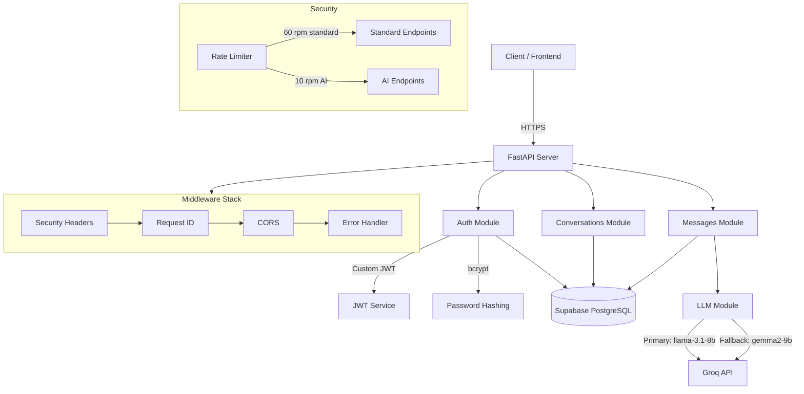

# AI Conversation API

Production-grade REST API for managing AI conversations with streaming support. Built with FastAPI, Supabase PostgreSQL, Groq LLM, and custom JWT authentication.

## Architecture



## Tech Stack

| Component | Technology |
|-----------|-----------|
| Framework | FastAPI + Uvicorn |
| Database | Supabase PostgreSQL |
| LLM Provider | Groq (llama-3.1-8b-instant + gemma2-9b-it fallback) |
| Auth | Custom JWT (bcrypt + PyJWT) |
| Streaming | Server-Sent Events (SSE) |
| Token Counting | tiktoken (cl100k_base) |
| Validation | Pydantic v2 |

## Prerequisites

- **Python 3.11+** (tested with Python 3.14)
- **Groq API key** — get one at [console.groq.com](https://console.groq.com)
- **Supabase project** — database schema must be applied (see Step 3 below)

## Quick Start

### 1. Clone the repository

```bash
git clone <repository-url>
cd conversation-api
```

### 2. Create virtual environment and install dependencies

```bash
python3 -m venv .venv
source .venv/bin/activate    # On macOS/Linux
# .venv\Scripts\activate     # On Windows

pip install -e ".[dev]"
```

### 3. Set up the database

Run the SQL from `database/schema.sql` in the Supabase SQL Editor:
- Go to [Supabase Dashboard](https://supabase.com/dashboard) > your project > **SQL Editor**
- Copy and paste the contents of `database/schema.sql`
- Click **Run**

This creates 4 tables with indexes, triggers, and RLS policies:
- `users` — User accounts with bcrypt password hashes
- `conversations` — Chat sessions with model and token tracking
- `messages` — Individual messages with token counts and cost estimates
- `refresh_tokens` — Hashed refresh tokens for JWT rotation

### 4. Configure environment variables

```bash
cp .env.example .env
```

All values are pre-filled in `.env.example` **except the Groq API key**. Open `.env` and add your Groq API key:

```
GROQ_API_KEY=gsk_your_actual_groq_api_key_here
```

| Variable | Pre-filled? | Description |
|----------|:-----------:|-------------|
| `SUPABASE_URL` | Yes | Supabase project URL |
| `SUPABASE_ANON_KEY` | Yes | Supabase anon/public key |
| `SUPABASE_SERVICE_ROLE_KEY` | Yes | Supabase service role key (bypasses RLS) |
| `JWT_SECRET_KEY` | Yes | Secret key for signing JWTs |
| `GROQ_API_KEY` | **No** | Groq API key — you must provide this |
| `GROQ_PRIMARY_MODEL` | Yes | Primary LLM model (llama-3.1-8b-instant) |
| `GROQ_FALLBACK_MODEL` | Yes | Fallback LLM model (gemma2-9b-it) |
| All others | Yes | Rate limits, CORS, app config |

### 5. Run the server

```bash
source .venv/bin/activate   # if not already activated
uvicorn src.main:app --reload
```

Server starts at `http://localhost:8000`

- **Swagger UI**: http://localhost:8000/docs
- **ReDoc**: http://localhost:8000/redoc
- **Health check**: http://localhost:8000/health

### 6. Run tests

```bash
source .venv/bin/activate
pytest tests/ -v
```

All 39 tests should pass (requires database and Groq API key to be configured).

## API Endpoints

### Auth

| Method | Endpoint | Description | Auth |
|--------|----------|-------------|------|
| POST | `/api/v1/auth/register` | Register a new user | No |
| POST | `/api/v1/auth/login` | Login, get access + refresh tokens | No |
| POST | `/api/v1/auth/refresh` | Rotate refresh token | No |
| POST | `/api/v1/auth/logout` | Revoke refresh token | Yes |

### Conversations

| Method | Endpoint | Description | Auth |
|--------|----------|-------------|------|
| POST | `/api/v1/conversations` | Create conversation | Yes |
| GET | `/api/v1/conversations` | List conversations (paginated) | Yes |
| GET | `/api/v1/conversations/{id}` | Get conversation details | Yes |
| PATCH | `/api/v1/conversations/{id}` | Update conversation | Yes |
| DELETE | `/api/v1/conversations/{id}` | Delete conversation + messages | Yes |

### Messages

| Method | Endpoint | Description | Auth |
|--------|----------|-------------|------|
| POST | `/api/v1/conversations/{id}/messages` | Send message (non-streaming) | Yes |
| POST | `/api/v1/conversations/{id}/messages/stream` | Send message (SSE streaming) | Yes |
| GET | `/api/v1/conversations/{id}/messages` | List messages (paginated) | Yes |

### Streaming Events

| Method | Endpoint | Description | Auth |
|--------|----------|-------------|------|
| GET | `/api/v1/conversations/{id}/events` | SSE stream of real-time conversation events | Yes |

### Utility

| Method | Endpoint | Description | Auth |
|--------|----------|-------------|------|
| GET | `/health` | Health check | No |
| GET | `/api/v1/models` | Available LLM models | No |
| GET | `/api/v1/usage/stats` | Token usage statistics | Yes |

## Usage Examples

### Register and login

```bash
# Register
curl -X POST http://localhost:8000/api/v1/auth/register \
  -H "Content-Type: application/json" \
  -d '{"email": "user@example.com", "username": "testuser", "password": "SecurePass1"}'

# Login — returns access_token and refresh_token
curl -X POST http://localhost:8000/api/v1/auth/login \
  -H "Content-Type: application/json" \
  -d '{"email": "user@example.com", "password": "SecurePass1"}'
```

### Create conversation and send message

```bash
# Create conversation
curl -X POST http://localhost:8000/api/v1/conversations \
  -H "Authorization: Bearer YOUR_ACCESS_TOKEN" \
  -H "Content-Type: application/json" \
  -d '{"title": "My Chat"}'

# Send message (non-streaming)
curl -X POST http://localhost:8000/api/v1/conversations/CONV_ID/messages \
  -H "Authorization: Bearer YOUR_ACCESS_TOKEN" \
  -H "Content-Type: application/json" \
  -d '{"content": "Hello, how are you?"}'

# Stream message (SSE)
curl -N -X POST http://localhost:8000/api/v1/conversations/CONV_ID/messages/stream \
  -H "Authorization: Bearer YOUR_ACCESS_TOKEN" \
  -H "Content-Type: application/json" \
  -d '{"content": "Explain quantum computing"}'
```

### Stream conversation events (SSE)

```bash
curl -N http://localhost:8000/api/v1/conversations/CONV_ID/events \
  -H "Authorization: Bearer YOUR_ACCESS_TOKEN"
```

### Refresh token rotation

```bash
curl -X POST http://localhost:8000/api/v1/auth/refresh \
  -H "Content-Type: application/json" \
  -d '{"refresh_token": "YOUR_REFRESH_TOKEN"}'
```

## SSE Streaming Event Format

The streaming endpoint emits Server-Sent Events following the Claude/OpenAI spec:

```
event: message_start
data: {"type": "message_start", "message": {"id": "...", "role": "assistant", "model": "..."}}

event: content_block_start
data: {"type": "content_block_start", "index": 0, "content_block": {"type": "text", "text": ""}}

event: content_block_delta
data: {"type": "content_block_delta", "index": 0, "delta": {"type": "text_delta", "text": "Hello"}}

... (more content_block_delta events)

event: content_block_stop
data: {"type": "content_block_stop", "index": 0}

event: message_delta
data: {"type": "message_delta", "delta": {"stop_reason": "end_turn"}, "usage": {"prompt_tokens": 88, "completion_tokens": 42}}

event: message_stop
data: {"type": "message_stop"}
```

## Security Measures

- **Custom JWT Auth**: 15-minute access tokens, 7-day refresh tokens with rotation
- **Password Requirements**: Min 8 chars, uppercase, lowercase, digit
- **Refresh Token Hashing**: SHA-256 hashed before storage
- **Rate Limiting**: 60 rpm standard endpoints, 10 rpm AI endpoints (sliding window)
- **Security Headers**: X-Content-Type-Options, X-Frame-Options, X-XSS-Protection, HSTS, Referrer-Policy, Permissions-Policy
- **Request IDs**: Unique X-Request-ID on every response for tracing
- **Input Validation**: Pydantic v2 strict validation on all inputs
- **Error Handling**: Structured JSON error responses, never exposes stack traces
- **CORS**: Specific allowed origins (not wildcard `*`)
- **SQL Injection Prevention**: Parameterized queries via Supabase client
- **Authorization**: App-level user_id filtering on all queries + RLS as defense-in-depth

## Project Structure

```
conversation-api/
├── README.md
├── pyproject.toml
├── .env.example           # Pre-filled config (just add GROQ_API_KEY)
├── .gitignore
├── src/
│   ├── main.py            # FastAPI app, middleware, routers, bonus endpoints
│   ├── config/
│   │   ├── settings.py    # Pydantic Settings (loads .env)
│   │   └── cors.py        # CORS configuration
│   ├── auth/
│   │   ├── jwt.py         # JWT creation, verification, refresh token hashing
│   │   ├── dependencies.py # get_current_user, verify_conversation_ownership
│   │   └── routes.py      # Register, login, refresh, logout
│   ├── conversations/
│   │   ├── schemas.py     # Pydantic request/response models
│   │   ├── repository.py  # Supabase CRUD queries
│   │   ├── service.py     # Business logic
│   │   └── routes.py      # CRUD endpoints
│   ├── messages/
│   │   ├── schemas.py     # Pydantic request/response models
│   │   ├── streaming.py   # SSE event formatter & generator
│   │   ├── service.py     # LLM orchestration, persistence, auto-title
│   │   └── routes.py      # Send, stream, list endpoints
│   ├── llm/
│   │   ├── client.py      # Groq client with model fallback
│   │   ├── prompts.py     # System prompt, title generation prompt
│   │   ├── context.py     # Sliding window context management
│   │   └── token_counter.py # tiktoken-based token counting
│   ├── middleware/
│   │   ├── rate_limiter.py     # Sliding-window per-user rate limiting
│   │   ├── request_id.py       # X-Request-ID middleware
│   │   ├── error_handler.py    # Global structured error handler
│   │   └── security_headers.py # Security headers middleware
│   ├── db/
│   │   ├── client.py      # Supabase client singleton
│   │   └── models.py      # Table name constants
│   └── utils/
│       ├── cost_tracker.py # Hypothetical cost calculation
│       └── validators.py   # UUID validation, pagination helpers
├── database/
│   ├── schema.sql         # PostgreSQL schema (run in Supabase SQL Editor)
│   └── setup.py           # Helper script for DB setup
├── tests/
│   ├── conftest.py        # Shared fixtures
│   ├── test_auth.py       # Auth endpoint tests (12 tests)
│   ├── test_conversations.py # Conversation CRUD tests (11 tests)
│   ├── test_messages.py   # Message endpoint tests (7 tests)
│   └── test_streaming.py  # SSE streaming & security tests (9 tests)
└── docs/
    └── architecture.md    # Detailed architecture decisions
```
